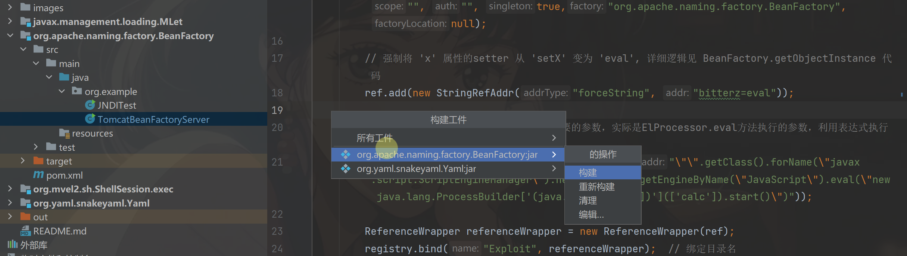

# JNDIBypass
高版本java各种JNDI Bypass方法复现+相应RMI服务端代码

关于本仓库所有的绕过方法复现使用可以看我的这篇[博客](https://ltmthink.github.io/2024/03/18/JNDIBypass/)

所有的复现都是基于[这篇文章](https://www.cnblogs.com/bitterz/p/15946406.html#11-%E6%80%9D%E8%B7%AF%E4%B8%80%E7%9A%84%E6%BA%90%E7%A0%81%E5%88%86%E6%9E%90),想要详细了解原理的可以去查看

#### 将相关源码利于与远程服务端示例

以org.apache.naming.factory.BeanFactory这个类为例,进入相关目录找到相应服务端的代码

然后将所有的127.0.0.1修改为个人服务器的ip

构建工件获得相应jar包

将相应jar包上传至个人服务器,并使用`java -jar xxxx.jar`运行

修改对应JNDITest.java文件内的ip地址

运行JNDITest.jar即可触发JNDI漏洞弹出计算机

